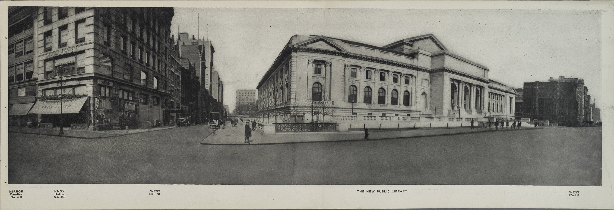
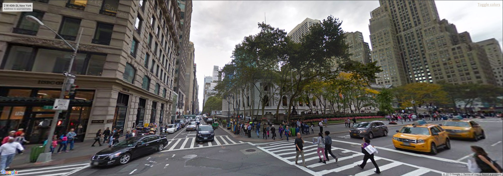
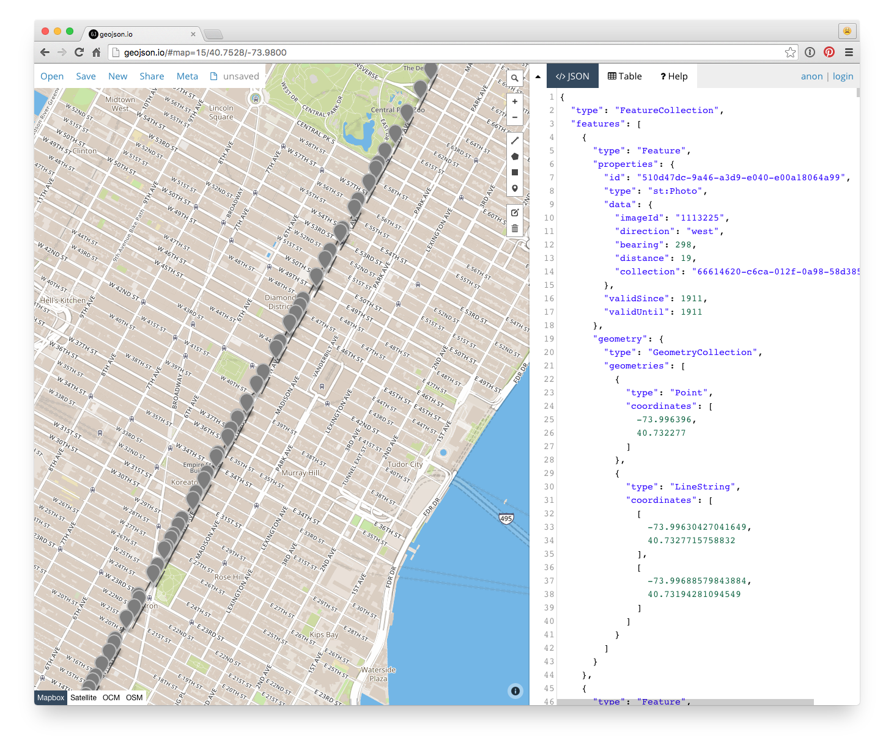

# Street View, Then & Now: New York City's Fifth Avenue

__Take me to 1911! Visit http://publicdomain.nypl.org/fifth-avenue/__

_Street View, Then & Now: New York City's Fifth Avenue is_ a [public domain remix](http://publicdomain.nypl.org) by [Bert Spaan](https://twitter.com/bertspaan) of [NYPL Labs](http://labs.nypl.org), using the [Fifth Avenue from Start to Finish collection](http://digitalcollections.nypl.org/collections/fifth-avenue-new-york-from-start-to-finish#/?tab=about) from 1911, it lets you compare the photos from this collection with
2015's [Google Street View](https://www.google.nl/maps/@40.7528429,-73.9813567,3a,75y,299.2h,96.54t/data=!3m6!1e1!3m4!1sFR-Gcj5IDRGxJ72fhcikWw!2e0!7i13312!8i6656).




## Data

The locations and fields-of-view of each photo are loaded from a single GeoJSON file: [`data/fields-of-view.json`](data/fields-of-view.json) (view this file on [geojson.io](http://geojson.io/#data=data:text/x-url,https%3A%2F%2Fraw.githubusercontent.com%2FNYPL-publicdomain%2Ffifth-avenue%2Fgh-pages%2Fdata%2Ffields-of-view.json)).

[](data/fields-of-view.json)

This data comes from the [Space/Time Directory](http://spacetime.nypl.org/) Digital Collections dataset, in [Histograph](https://github.com/histograph/histograph)'s NDJSON format: [`digital-collections.pits.ndjson`](https://github.com/nypl-spacetime/data/blob/master/digital-collections/digital-collections.pits.ndjson).

Each line in this NDJSON file represents a Digital Collection item, and contains it's UUID, as well as additional information about the photo's location and [field of view](https://en.wikipedia.org/wiki/Field_of_view):

```json
{
  "id": "510d47dc-9a46-a3d9-e040-e00a18064a99",
  "type": "st:Photo",
  "data": {
    "imageId": "1113225",
    "direction": "west",
    "bearing": 298,
    "distance": 19,
    "collection": "66614620-c6ca-012f-0a98-58d385a7bc34"
  },
  "validSince": 1911,
  "validUntil": 1911,
  "geometry": {
    "type": "Point",
    "coordinates": [
      -73.996396,
      40.732277
    ]
  }
}
```

With Space/Time's [field-of-view](https://github.com/nypl-spacetime/field-of-view) module, we can convert this dataset to a GeoJSON file containing field-of-view geometries.

---
### About the NYPL Public Domain Release

On January 6, 2016, The New York Public Library enhanced access to public domain items in Digital Collections so that everyone has the freedom to enjoy and reuse these materials in almost limitless ways. For all such items the Library now makes it possible to download the highest resolution images available directly from the [Digital Collections](http://digitalcollections.nypl.org) website. 

That means more than 187,000 items free to use without restriction! But we know that 180K of anything is a lot to get your head around — so as a way to introduce you to these collections and inspire new works, NYPL Labs developed a suite of [projects and tools](http://nypl.org/publicdomain) to help you explore the vast collections and dive deep into specific ones. 

Go forth, reuse, and let us know what you made with the #nyplremix hashtag! For more information:

- [NYPL Labs Remix Residency](http://www.nypl.org/help/about-nypl/fellowships-institutes/remix)
- [Data & Tools](https://github.com/NYPL-publicdomain/data-and-utilities)
- [Public Domain Collections](http://publicdomain.nypl.org)
- [Project Credits](https://github.com/NYPL-publicdomain/nypl-publicdomain.github.io#credits-for-the-january-2016-nypl-public-domain-release)

### License

See [license](/LICENSE).
